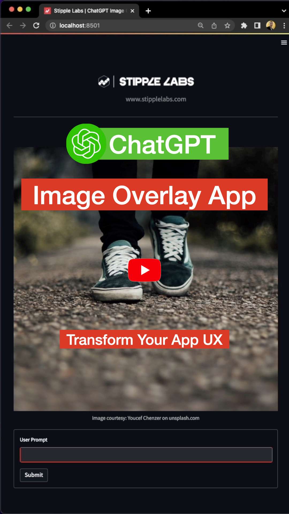
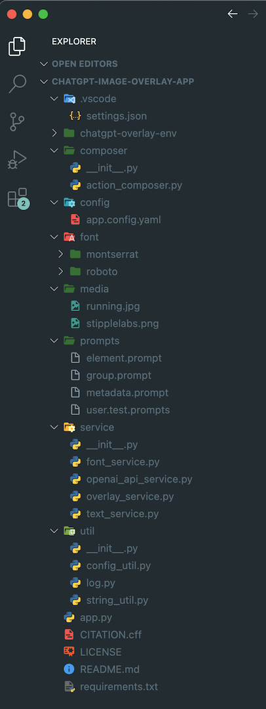

🌟 Discover the fantastic potential of ChatGPT API with my ChatGPT Image Overlay App! I've leveraged OpenAI's ChatGPT to harness the incredible capabilities of OpenAI's ChatGPT to create image overlays with simple, natural language commands. This demo demonstrates the power of GPT-3.5 in creating intelligent, dynamic, responsive applications that can learn and adapt to user input while accounting for the inherent randomness of AI models.

### Demo

### Architecture and Design
Please see my blog post: [Transform Your App's User Experience With ChatGPT](https://stipplelabs.medium.com/chatgpt-image-overlay-app-transform-your-apps-user-experience-with-chatgpt-f74f392e0b8d?source=friends_link&sk=34e53edeea2ee42900f8c21a898a3611)

### Follow me for more interesting articles on AI:
- [Stipple Labs - Website](https://www.stipplelabs.com/)
- [Stipple Labs - Twitter](https://twitter.com/stipplelabs)
- [Mahesha - Twitter](https://twitter.com/maheshagodekere)
- [Stipple Labs - YouTube](https://www.youtube.com/@stipplelabs)
- [Mahesha Godekere - LinkedIn](https://in.linkedin.com/in/maheshagodekere)

### Prerequisite

Leveraging API calls to LLM for quickly building software applications with conversational interfaces still needs to be appreciated. Go through the course https://deeplearning.ai/short-courses/chatgpt-prompt-engineering-for-developers/ created by [@AndrewYNg](https://twitter.com/AndrewYNg) and [@OpenAI](https://twitter.com/OpenAI) to learn more about the ChatGPT prompt engineering process.

### Installation
- Clone this repo
- Make sure you have Python 3.8+ installed
- Create virtual env: \
  python3 -m venv chatgpt-overlay-env
- Activate the env: \
  source chatgpt-overlay-env/bin/activate
- Install all required packages: \
  pip3 install -r requirements.txt
- Check installed packages: pip3 list
- Setup OpenAI account and set environment variables for OpenAPI Key as defined \
  in https://help.openai.com/en/articles/5112595-best-practices-for-api-key-safety \
  Code fetches the OpenAPI Key using os.environ["OPENAI_API_KEY"]. \
  Please see the code in service/open_api_service.py for more details.  
- Run the Streamlit app locally: \
  streamlit run app.py\
  You can now view your Streamlit app in your browser.\
  Local URL: http://localhost:8501

  Use prompt/user.test.prompts to test the app before your wild exploration!

### Implementation Details

**app.py:** Contains the main application logic and Streamlit setup, such as handling user input and integrating various components.

**composer/action_composer.py:** Processing user actions from Chat GPT JSON response to draw overlays on an image.

**config/app_config.yaml:** Defines various application configurations.

**font/*:** Holds introductory text fonts

**media/*:** Holds essential media files

**prompts/*:** Holds OpenAI Chat GPT prompts

**service/*:** Provides services for image overlay and OpenAI communication

**utils/*:** Provides various utility functions

**requirements.txt:** has all the project's dependencies

### ⚠️ Disclaimer
Please note that the code provided in this repository is not production-grade and has been created solely for the purpose of testing the potential of ChatGPT in incorporating natural language processing into web applications. It is intended for educational and research purposes only. Use this code at your own risk, and always ensure to follow best practices when developing production-ready applications.

### 🔓 Open Source License
This project is released under the GNU General Public License v3.0 (GPLv3), allowing you to freely use, modify, and distribute the code for personal, educational, and research purposes. We encourage collaboration and contribution from the community to help improve and expand the capabilities of this application. By using this code, you agree to abide by the terms and conditions specified in the LICENSE file in this repo.

### Citation
@software{ChatGPT Image Overlay App,\
&nbsp;&nbsp;&nbsp;&nbsp;author = {Godekere, Mahesha},\
&nbsp;&nbsp;&nbsp;&nbsp;month = {05},\
&nbsp;&nbsp;&nbsp;&nbsp;title = {{ChatGPT Image Overlay App}},\
&nbsp;&nbsp;&nbsp;&nbsp;url = {https://github.com/stipplelabs},\
&nbsp;&nbsp;&nbsp;&nbsp;version = {1.0},\
&nbsp;&nbsp;&nbsp;&nbsp;year = {2023}\
}
